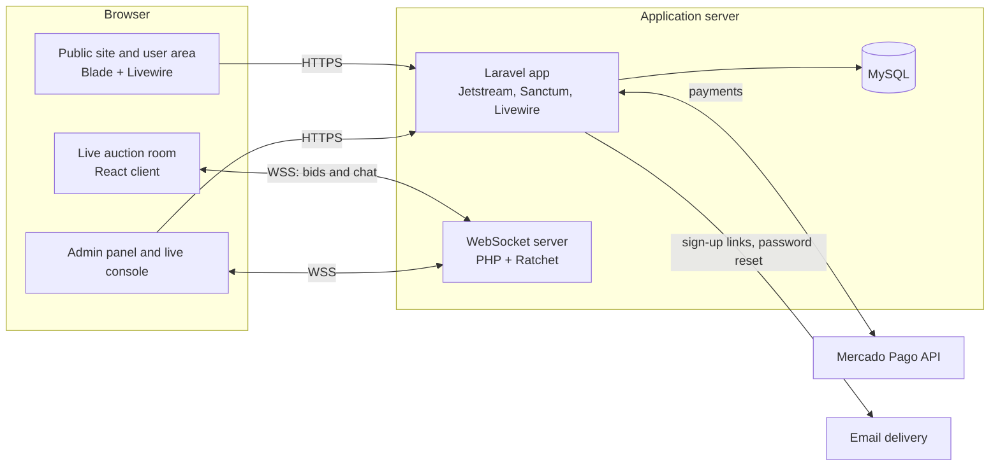

# Online Auction Platform — Case Study

A full stack platform that took a public auctioneer's auctions online: public promotion of upcoming auctions, secure sign-up, guarantee deposits through Mercado Pago, and a live bidding room for up to 50 concurrent users.

**Built:** 2021 · **Type:** Freelance · **Role:** Lead full stack developer

[The problem](#the-problem) ·
[The solution](#the-solution) ·
[My role](#my-role) ·
[Architecture](#architecture-at-a-glance) ·
[Key decisions](#key-technical-decisions) ·
[Challenges](#challenges-and-how-i-solved-them) ·
[What I'd do differently](#what-id-do-differently-today) ·
[Tech stack](#tech-stack) ·
[Docs](#documentation)

---

## The problem

A public auctioneer ran in-person auctions of vehicles, trucks, machinery, materials and swimming pools. They needed two things:

- A website to **promote upcoming auctions** and show the lots for each one.
- A way to **run the auctions online**, so registered bidders could take part remotely, safely, and with a guarantee that they could pay.

## The solution

- **Public website** that lists upcoming auctions and their lots, with photos and category-specific details (for example, extra technical data for vehicles).
- **Secure accounts:** email and password login protected by **two-factor authentication (TOTP)**. New users finish sign-up from a tokenized email link, and password reset works the same way.
- **Guarantee deposits with Mercado Pago:** to bid, a user pays a deposit for the active auction online, confirmed against Mercado Pago's own API before it's accepted.
- **Live auction room** over WebSockets, where up to **50 concurrent users** bid and chat in real time.
- **Admin panel:** user management, a live auction console to run the bidding and close lots, deposit activation for exceptions, lot image uploads, and post-auction reports.

## My role

I **led the full stack development end to end**, from data model and backend to UI, payments and real-time features, and I did the **whole deployment** myself, including DNS setup and the HTTPS certificate.

I worked with a second developer, who built the live auction room — its WebSocket server and real-time client — under my direction, while I owned the rest of the system. We used a simple Git flow: feature work merged into a `testing` branch through **pull requests**, then `testing` was promoted to `main` for production.

## Architecture at a glance

More detail in [docs/architecture.md](docs/architecture.md).

## Key technical decisions

**1. A Laravel monolith with server-rendered UI (Blade + Livewire)**
- *Why:* one small team, one codebase, one deployment. Livewire gave interactive admin screens without a separate SPA and API layer, and Jetstream gave production-ready authentication with 2FA out of the box.
- *Trade-off:* the frontend is tightly coupled to the backend. That was fine for this product, but it would make a native mobile app or a public API more work later.

**2. A dedicated WebSocket server (Ratchet) for the live room**
- *Why:* PHP's request/response cycle can't hold long-lived connections. A separate Ratchet process kept persistent connections open and broadcast every bid and chat message to all connected clients with very low latency.
- *Trade-off:* it's one more process to deploy, monitor and restart. As a pure relay, it also put the responsibility for bid consistency on the rest of the system (see "What I'd do differently today").

**3. Deposit activation tied to payment, with a manual override for exceptions**
- *Why:* when Mercado Pago redirects a user back to the app, the server re-checks that payment against Mercado Pago's own API before trusting it, and activates the deposit immediately if it's approved. That kept the common path fast, with no one waiting on a human. The admin panel can also activate a deposit by hand for cases outside that path, such as a payment arranged by phone.
- *Trade-off:* there's no server-to-server webhook as a backup, only the browser's redirect. A user who pays and never returns to the site could end up with a deposit that was never recorded (see "What I'd do differently today").

**4. Mercado Pago as the payment provider**
- *Why:* it's the dominant payment method in Argentina, users already trust it, and it has official SDKs for both PHP and JavaScript.
- *Trade-off:* it ties the platform to one regional provider, and its redirect-based confirmation shaped how deposits had to be verified.

## Challenges and how I solved them

- **Real-time bidding for up to 50 concurrent users.** HTTP polling would have been slow and wasteful. I added a persistent WebSocket server, so every bid reaches every participant almost instantly, with no polling.
- **Trusting bidders before they bid.** Anyone can create an account, so I gated bidding behind a verified sign-up and a paid guarantee deposit for that auction. The deposit is only accepted after the server confirms it directly with Mercado Pago.
- **Confirming a payment without trusting the browser.** A redirect's query string can be tampered with or arrive incomplete. I re-fetched the payment from Mercado Pago's API on the server before recording a deposit, so what gets saved reflects the provider's own status, not what the URL claims.
- **Account security for a money-related product.** I added TOTP two-factor authentication, and used tokenized email links for both registration and password reset.
- **Shipping to production by myself.** I configured the domain's DNS and the HTTPS certificate on the VPS, which secure WebSockets (WSS) and Mercado Pago's callbacks both require.

## What I'd do differently today

- **Role-based authorization.** Every admin screen only checked that someone was logged in and verified — not that they were actually an admin. Any registered account could technically reach them. I'd add a role to the user and enforce it with route middleware or policies, so a regular account structurally can't reach admin tools.
- **A real payment webhook.** Deposits were only confirmed through the browser's redirect back from Mercado Pago. I'd add their webhook as a backup, with idempotency on the payment ID, so a result is never missed because a user closed the tab, and never recorded twice.
- **Server-side bid validation.** The relay accepted whatever offer a client sent and broadcast it as-is. I'd make the server authoritative: check that the bidder's deposit is active and the new offer beats the current one, persist it, and only then broadcast it.
- **Automated tests:** feature tests for the deposit and bidding rules, running on every pull request.
- **CI/CD:** a pipeline (lint, tests, build, deploy) instead of manual deploys from `main`.
- **Containers:** Docker for the app, the WebSocket server and the database, so local, staging and production all match.
- **Stronger typing:** static analysis in PHP, and TypeScript for the live room client.
- **Managed real-time:** Laravel Reverb or a managed WebSocket service instead of a hand-rolled relay.

## Tech stack

| Layer | Technologies |
|---|---|
| Backend | PHP, Laravel, Laravel Jetstream (auth + TOTP 2FA), Laravel Sanctum, Livewire |
| Frontend | Blade, Tailwind CSS, Alpine.js, Laravel Mix |
| Real-time | Standalone WebSocket server in PHP (Ratchet), React client for the live room |
| Database | MySQL |
| Payments | Mercado Pago (official PHP SDK and JS SDK) |
| Auth | Email + password with TOTP 2FA, tokenized email links for sign-up and password reset |
| Infrastructure | VPS, DNS and HTTPS configuration, production deployment |
| Workflow | Git, `testing` → `main` branches with pull requests |

## Documentation

- [Architecture and technical decisions](docs/architecture.md)
- [Data model (ER diagram)](docs/data-model.md)
- [Key flows (sequence diagrams)](docs/flows.md)

This repository's own content — the write-up, diagrams and docs — is [MIT licensed](LICENSE). The original client source code isn't included here and remains private.

---

> Source code is private (client project). This repository documents the architecture and my approach.

---

Leonel Quiroga · [github.com/leonelquiroga](https://github.com/leonelquiroga) · [linkedin.com/in/leonel-quiroga-engineer](https://www.linkedin.com/in/leonel-quiroga-engineer/)
