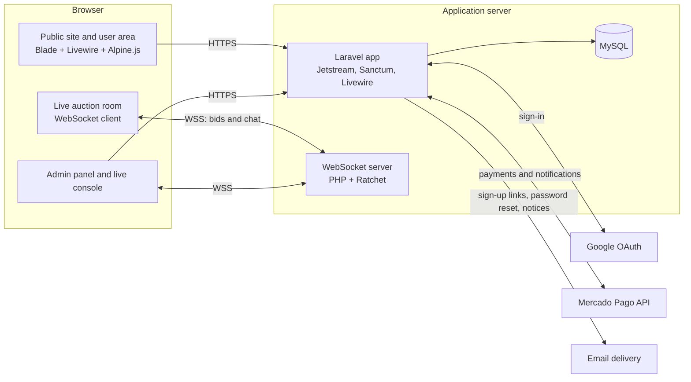

# Online Auction Platform — Case Study

A full stack platform that took a public auctioneer's auctions online: public promotion of upcoming auctions, secure sign-up, guarantee deposits through Mercado Pago, and a live bidding room for up to 50 concurrent users.

**Timeline:** 2019, with support until 2020 · **Type:** Freelance · **Role:** Lead full stack developer
<!-- TODO: Confirm the dates. Laravel Jetstream and DaisyUI were released in 2020, so the codebase as it exists today may come from a 2020 rewrite or upgrade. -->

---

## The problem

A public auctioneer ran in-person auctions of vehicles, trucks, machinery, materials and swimming pools. They needed two things:

- A website to **promote upcoming auctions** and show the lots for each one.
- A way to **run the auctions online**, so registered bidders could take part remotely, safely, and with a guarantee that they could pay.

## The solution

- **Public website** that lists upcoming auctions and their lots, with photos and category-specific details (for example, extra technical data for vehicles).
- **Secure accounts:** Google sign-in, or email and password with **two-factor authentication (TOTP)**. New users finish sign-up from a tokenized email link.
- **Guarantee deposits with Mercado Pago:** to bid in an auction, a user pays a deposit online, and an admin then enables that deposit for that user.
- **Live auction room** over WebSockets, where up to **50 concurrent users** bid and chat in real time.
- **Winner flow:** when the auction ends, the winner is notified and pays through Mercado Pago.
- **Admin panel:** user management, deposit approval, lot image uploads, a live auction console, and post-auction reports.

## My role

I **led the full stack development end to end**, from data model and backend to UI, payments and real-time features, and I did the **whole deployment** myself, including DNS setup and the HTTPS certificate.

I worked with a second developer. We used a simple Git flow: feature work merged into a `testing` branch through **pull requests**, then `testing` was promoted to `main` for production.
<!-- TODO: Describe which parts the second developer built. -->

## Architecture at a glance

More detail in [docs/architecture.md](docs/architecture.md).

## Key technical decisions

**1. A Laravel monolith with server-rendered UI (Blade + Livewire)**
- *Why:* one small team, one codebase, one deployment. Livewire gave interactive admin screens without a separate SPA and API layer, and Jetstream gave production-ready authentication with 2FA out of the box.
- *Trade-off:* the frontend is tightly coupled to the backend. That was fine for this product, but it would make a native mobile app or a public API more work later.

**2. A dedicated WebSocket server (Ratchet) for the live room**
- *Why:* PHP's request/response cycle can't hold long-lived connections. A separate Ratchet process kept persistent connections open and broadcast every bid and chat message to all connected clients with very low latency.
- *Trade-off:* it's one more process to deploy, monitor and restart. As a pure relay, it also put the responsibility for bid consistency on the rest of the system (see "What I'd do differently today").

**3. Guarantee deposits with manual admin approval**
- *Why:* the auctioneer needed to know that every bidder was real and able to pay. Mercado Pago handled the money, and an admin enabled each deposit per user and per auction before that user could bid.
- *Trade-off:* the manual step adds friction and depends on an admin being available, but it matched how the business already worked and kept a human in control of who could bid.

**4. Mercado Pago as the payment provider**
- *Why:* it's the dominant payment method in Argentina, users already trust it, and it has official SDKs for both PHP and JavaScript.
- *Trade-off:* it ties the platform to one regional provider, and payment status arrives asynchronously, so the app has to reconcile redirects and webhooks.

## Challenges and how I solved them

- **Real-time bidding for up to 50 concurrent users.** HTTP polling would have been slow and wasteful. I added a persistent WebSocket server, so every bid reaches every participant almost instantly, with no polling.
- **Trusting bidders before they bid.** Anyone can create an account, so I built a gate: email-verified sign-up, then a paid guarantee deposit, then admin approval per auction. Only after all three can a user bid.
- **Payments that confirm asynchronously.** A payment's final status doesn't always arrive with the user's redirect. I handled the confirmation from Mercado Pago on the server, so a deposit is recorded from the provider's own status, not from what the browser claims.
<!-- TODO: Confirm whether deposits were confirmed by the return redirect, by webhook notifications, or both. -->
- **Account security for a money-related product.** I added TOTP two-factor authentication alongside Google sign-in, and used tokenized email links for both registration and password reset.
- **Shipping to production by myself.** I configured the domain's DNS and the HTTPS certificate, which secure WebSockets (WSS) and payment callbacks both require.
<!-- TODO: Add the hosting setup (VPS, shared hosting, other) and how the Ratchet process was kept alive (Supervisor, pm2, systemd). -->

## What I'd do differently today

- **Automated tests:** feature tests for the deposit and bidding rules, plus contract tests for payment webhooks, running on every pull request.
- **CI/CD:** a GitHub Actions pipeline (lint, tests, build, deploy) instead of manual deploys from `main`.
- **Containers:** Docker for the app, the WebSocket server and the database, so local, staging and production all match.
- **Stronger typing:** strict types and static analysis (PHPStan/Larastan) in PHP, and TypeScript for the live room client.
- **Managed real-time:** Laravel Reverb or a managed WebSocket service instead of a hand-rolled relay. I'd also make the server authoritative: validate each bid (deposit enabled, amount above the current highest bid) and persist it *before* broadcasting it.
- **Queues for notifications:** send emails and winner notices from background jobs, so a slow mail provider never blocks a request.
- **Idempotent webhooks:** store each payment notification's ID and ignore duplicates, so a retried webhook can never record a payment twice.

## Tech stack

| Layer | Technologies |
|---|---|
| Backend | PHP, Laravel, Laravel Jetstream (auth + TOTP 2FA), Laravel Sanctum, Livewire |
| Frontend | Blade, Tailwind CSS, DaisyUI, Alpine.js, Laravel Mix |
| Real-time | Standalone WebSocket server in PHP (Ratchet) |
| Database | MySQL |
| Payments | Mercado Pago (official PHP SDK and JS SDK) |
| Auth | Email + password with TOTP 2FA, Google sign-in, email token links |
| Infrastructure | DNS and HTTPS configuration, production deployment <!-- TODO: hosting provider --> |
| Workflow | Git, `testing` → `main` branches with pull requests |

## Documentation

- [Architecture and technical decisions](docs/architecture.md)
- [Data model (ER diagram)](docs/data-model.md)
- [Key flows (sequence diagrams)](docs/flows.md)

---

> Source code is private (client project). This repository documents the architecture and my approach.

---

Leonel Quiroga · [github.com/leonelquiroga](https://github.com/leonelquiroga) · [linkedin.com/in/leonelquiroga](https://www.linkedin.com/in/leonelquiroga)
