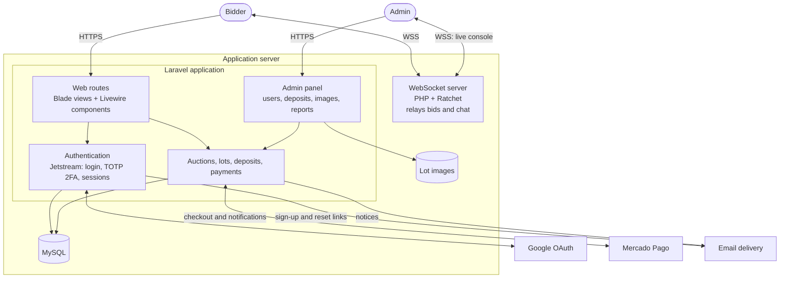

# Architecture and technical decisions

[Back to README](../README.md)

This document explains how the platform was built: its components, how they talk to each other, and why I made each decision.

## System overview

<!-- TODO: Where were lot images stored (local disk, S3, other)? The diagram assumes local storage. -->

## Components

### Laravel application

The core of the system is a single Laravel application. It serves:

- **The public site:** upcoming auctions, lots by category (vehicles, trucks, machinery, materials, swimming pools) and lot details. Vehicle lots have an extra table for technical information.
- **The user area:** profile (with country, province and city), auction registration and guarantee deposits.
- **The admin panel:** user management (edit and delete), deposit approval, lot image uploads, the live auction console and auction reports.

The UI is server-rendered with **Blade** and styled with **Tailwind CSS + DaisyUI**. **Livewire** handles interactive screens without a separate SPA, and **Alpine.js** covers small client-side behavior. Assets are compiled with **Laravel Mix**.

**Laravel Sanctum** is installed for token and SPA authentication, and **CORS** is enabled.
<!-- TODO: What was Sanctum used for in practice (for example, authenticating the live room client)? -->

### Authentication

- **Email and password** through **Laravel Jetstream**, with **TOTP two-factor authentication**. The `users` table stores the 2FA secret and recovery codes, and users enable 2FA with any authenticator app.
- **Google sign-in** as an alternative.
  <!-- TODO: Laravel Socialite isn't in the project's dependencies. How was Google sign-in implemented (Google JS SDK, a direct OAuth integration, another package)? -->
- **Registration by email link:** users sign up, receive an email with a tokenized link, and finish sign-up from it. Password reset uses the same token mechanism.
- **Roles:** `user` and `admin`. Admin tools are only available to the `admin` role.
  <!-- TODO: Confirm how roles were stored and enforced (column on users, middleware, gates). -->

### Real-time: the live auction room

The live room runs on a **separate WebSocket server written in PHP with Ratchet**. It runs as its own long-lived process next to the Laravel app.

Its job is intentionally simple: **when a client sends a message (a bid or a chat message), the server forwards it to every other connected client.** It was sized for up to **50 concurrent users** per auction.

The project also lists `beyondcode/laravel-websockets` as a dependency.
<!-- TODO: Was laravel-websockets used for anything, or was it an earlier approach replaced by Ratchet? -->
<!-- TODO: Was the live room UI built with Blade + Alpine.js/vanilla JS, or with React loaded separately? React isn't in package.json. -->
<!-- TODO: How did the Ratchet process stay alive in production (Supervisor, pm2, systemd)? -->

**Why a separate process?** PHP-FPM handles one request and finishes, so it can't keep a connection open for the whole auction. Ratchet runs an event loop that holds every connection open in one process, which suits a small, bursty audience like a live auction.

### Payments: Mercado Pago

The platform uses the **official Mercado Pago SDKs**: the PHP SDK on the server, and the JS SDK in the browser for checkout.

Payments happen at two moments:

1. **Guarantee deposit:** required before a user can bid in a specific auction. After payment, an admin reviews it and enables the deposit for that user.
2. **Winner payment:** after the auction closes, the winner pays through Mercado Pago.
   <!-- TODO: Was the winner's payment the full amount, or the balance after subtracting the guarantee deposit? -->

Payment status is confirmed through the **return redirect** and/or **Mercado Pago notifications (webhooks)**. See [flows.md](flows.md#2-registration-and-guarantee-deposit).

### Database

**MySQL**, with the schema managed by Laravel migrations. See [data-model.md](data-model.md).

## Deployment

I handled the whole production deployment:

- **DNS** configuration for the client's domain.
- **HTTPS certificate.** It matters here for more than security: browsers require secure WebSockets (`wss://`) on HTTPS pages, and payment provider callbacks need HTTPS endpoints.
- Production deploys from the `main` branch.

<!-- TODO: Hosting type (VPS, shared hosting, other) and provider. -->
<!-- TODO: Certificate provider (for example, Let's Encrypt with automatic renewal). -->

## Development workflow

- Two developers: I led the project and worked with a second developer.
- **Branches:** work merged into `testing` through **pull requests** for review and QA, then `testing` was merged into `main` for production.

## Decision log

| Decision | Why | Trade-off |
|---|---|---|
| Laravel monolith with Blade + Livewire | Small team, fast delivery, one deployment; Jetstream gives secure auth and 2FA out of the box | Frontend tightly coupled to backend; a mobile app or public API would need extra work |
| Separate Ratchet WebSocket server | PHP request lifecycle can't hold persistent connections; low latency for live bids | Extra process to operate; a pure relay doesn't validate messages |
| Guarantee deposit + manual admin approval | Make sure every bidder is real and able to pay; matches the auctioneer's existing process | Manual step adds friction and depends on admin availability |
| Mercado Pago | Dominant local payment method, trusted by users, official PHP and JS SDKs | Regional lock-in; asynchronous confirmation has to be reconciled |
| Email token links for sign-up and password reset | One mechanism for two flows; proves ownership of the email address | Depends on email deliverability |
| TOTP 2FA + Google sign-in | Stronger security for a product that involves money, without forcing one login method | More auth paths to maintain and test |

## Known limitations (and how I'd address them today)

- **The relay server trusts clients.** The WebSocket server forwards messages without validating them. Today I'd make the server authoritative: check that the bidder's deposit is enabled and that the amount beats the current highest bid, persist it, and only then broadcast it. Laravel Reverb would let that logic live in the same codebase.
- **No automated tests or CI.** I'd add feature tests for deposit and bidding rules and a GitHub Actions pipeline that runs on every pull request.
- **Synchronous notifications.** Emails would move to queued jobs with retries.
- **Webhook idempotency.** I'd store each payment notification's ID and ignore repeats.
- **Environment drift.** Docker would make local, staging and production match.
