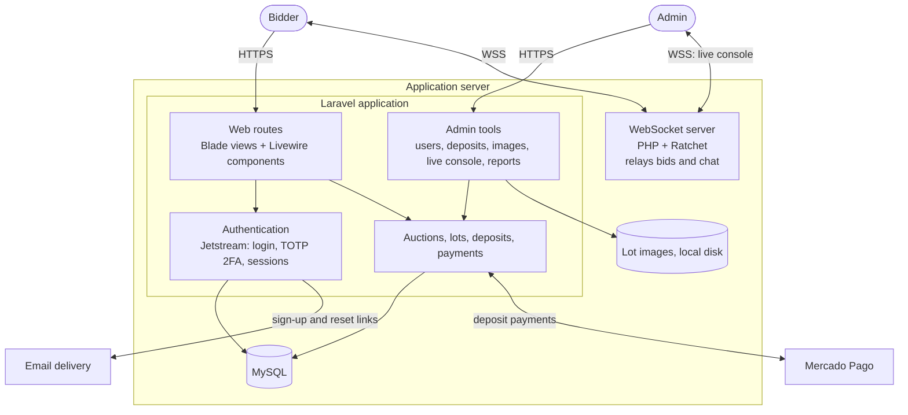

# Architecture and technical decisions

[Back to README](../README.md)

This document explains how the platform was built: its components, how they talk to each other, and why I made each decision.

## System overview

## Components

### Laravel application

The core of the system is a single Laravel application. It serves:

- **The public site:** upcoming auctions, lots by category (vehicles, trucks, machinery, materials, swimming pools) and lot details. Vehicle lots carry an extra free-text field for technical information.
- **The user area:** profile (including a national tax ID, used in Argentina to verify a bidder's identity) and the guarantee deposit for the active auction.
- **The admin tools:** user management, deposit activation for exceptions, lot image uploads, the live auction console, and post-auction reports.

The UI is server-rendered with **Blade** and styled with **Tailwind CSS**. **Livewire** handles interactive screens (editing a user, completing registration, the deposit payment form) without a separate SPA. Assets are compiled with **Laravel Mix**.

**Laravel Sanctum** guards both the web routes (as a session-based guard) and the small JSON API the live room talks to, so the same authentication covers Blade pages and API calls.

### Authentication

- **Email and password** through **Laravel Jetstream**, with **TOTP two-factor authentication**. The `users` table carries Jetstream's standard 2FA columns (encrypted secret and recovery codes), and a recovery code works if a user loses their device.
- **Registration by email link:** users sign up, receive an email with a tokenized link, and finish sign-up from it. Password reset uses the same token mechanism, stored directly on the user's row.
- **Access control:** regular users and admin tools weren't actually separated by a role. Every admin screen was gated by the same check as any other logged-in page — being authenticated and verified — not by checking that the account was an admin. In practice, any registered user could reach them. I cover the fix in "What I'd do differently today" in the [README](../README.md).

### Real-time: the live auction room

The live room runs on a **separate WebSocket server written in PHP with Ratchet**, running as its own long-lived process next to the Laravel app, built directly from Ratchet's own server pattern: an `IoServer` wrapping a `WsServer` around a small message handler.

Its job is intentionally simple: **when a client sends a message, the server forwards it to every other connected client.** It doesn't inspect or validate what it relays. It was sized for up to **50 concurrent users** per auction.

The live room's client is a **React application**, built separately from the Laravel app and served as a compiled bundle (its source isn't part of this repository, only the built static assets). `beyondcode/laravel-websockets` is also listed as a dependency, but the real-time path actually in use is the custom Ratchet server above.

**Why a separate process?** PHP-FPM handles one request and finishes, so it can't keep a connection open for the whole auction. Ratchet runs an event loop that holds every connection open in one process, which suits a small, bursty audience like a live auction.

Bids aren't only broadcast over the socket — the client also calls a small Laravel JSON endpoint to persist each offer, keyed by lot and user. That endpoint accepts whatever amount the client sends, with no check that it beats the current highest offer; see "What I'd do differently today."

### Payments: Mercado Pago

The platform uses the **official Mercado Pago SDKs**: the PHP SDK on the server, and the JS SDK in the browser for checkout.

The guarantee deposit flow:

1. The user pays through Mercado Pago's checkout.
2. Mercado Pago redirects the user back to the app with a payment ID in the URL.
3. The server takes that ID and **re-fetches the payment directly from Mercado Pago's API** — it never trusts the redirect's query string on its own.
4. If the provider reports the payment as approved, the deposit is recorded and activated immediately. No one has to review it.

There's no webhook as a backup to that redirect. If a user closes the tab before returning to the app, the payment can go unrecorded even though Mercado Pago approved it. The admin panel has a separate, manual way to activate a deposit for a user — meant for exceptions outside that normal flow, such as a payment arranged by phone — not as a required review step for every deposit.

Winner payment, after a lot closes, wasn't automated in the application: the admin identified the winner from the stored offers and arranged payment with them directly, outside the live room.

### Database

**MySQL**, with the schema managed by Laravel migrations. See [data-model.md](data-model.md).

The whole system is modeled around a **single active auction at a time** — most queries filter by "the auction currently marked active," rather than letting the business run several auctions in parallel.

## Deployment

I handled the whole production deployment:

- A **VPS**, configured and managed by me.
- **DNS** configuration for the client's domain.
- **HTTPS certificate.** It matters here for more than security: browsers require secure WebSockets (`wss://`) on HTTPS pages, and Mercado Pago's redirect back to the app needs an HTTPS endpoint.
- Production deploys from the `main` branch.

## Development workflow

- Two developers: I led the project end to end; a second developer built the live auction room (the WebSocket server and its React client) under my direction.
- **Branches:** work merged into `testing` through **pull requests** for review and QA, then `testing` was merged into `main` for production.

## Decision log

| Decision | Why | Trade-off |
|---|---|---|
| Laravel monolith with Blade + Livewire | Small team, fast delivery, one deployment; Jetstream gives secure auth and 2FA out of the box | Frontend tightly coupled to backend; a mobile app or public API would need extra work |
| Separate Ratchet WebSocket server | PHP request lifecycle can't hold persistent connections; low latency for live bids | Extra process to operate; a pure relay doesn't validate messages |
| Deposit activated on confirmed payment, admin override for exceptions | Fast, no human in the loop for the common case; server re-verifies against Mercado Pago's API instead of trusting the browser | No webhook as a backup — a missed redirect means a missed deposit |
| Mercado Pago | Dominant local payment method, trusted by users, official PHP and JS SDKs | Regional lock-in; confirmation depends entirely on the redirect, since no webhook was implemented |
| Email token links for sign-up and password reset | One mechanism for two flows; proves ownership of the email address | Depends on email deliverability |
| TOTP 2FA | Stronger security for a product that involves money | One more enrollment step for users |

## Known limitations (and how I'd address them today)

- **No role-based authorization.** Admin screens checked only that someone was logged in and verified, not that they were an admin. I'd add a role and enforce it in middleware or policies.
- **No payment webhook.** Deposits were confirmed only through the browser's redirect, re-verified server-side against Mercado Pago's API but with no server-to-server backup. I'd add the webhook, with idempotency on the payment ID.
- **The relay server trusts clients.** The WebSocket server forwards bids without validating them, and the API endpoint behind it accepts any offer value a client sends. Today I'd make the server authoritative: check the bidder's deposit and that the offer beats the current highest one, persist it, and only then broadcast it. Laravel Reverb would let that logic live in the same codebase.
- **Chat messages aren't attributed.** The stored chat history has no sender reference — only the live broadcast carries who sent what.
- **No automated tests or CI.** I'd add feature tests for deposit and bidding rules and a pipeline that runs on every pull request.
- **Environment drift.** Docker would make local, staging and production match.
