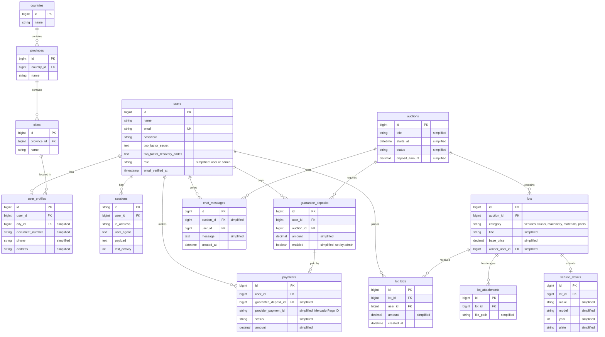

# Data model

[Back to README](../README.md)

The schema is based on the original project's migrations. Table names are translated to English here.

> **Note:** table names and their purpose come from the real migrations. Columns and relationships labeled **"simplified"** are inferred to explain the model and may not match the original columns exactly.

## Entity-relationship diagram

## Tables

| Table (English name) | Original purpose | Notes |
|---|---|---|
| `users` | Accounts and credentials | Includes Jetstream's TOTP 2FA columns (secret and recovery codes) |
| `user_profiles` | Personal data needed to bid | One profile per user, linked to a city |
| `countries` / `provinces` / `cities` | Location catalog | Three-level hierarchy for addresses |
| `auctions` | An auction event | Groups lots; deposits are paid per auction |
| `lots` | An item being auctioned | Categories: vehicles, trucks, machinery, materials, swimming pools |
| `lot_attachments` | Lot images | Uploaded from the admin panel |
| `vehicle_details` | Extra data for vehicle lots | Only vehicle lots have a row here |
| `guarantee_deposits` | Deposit a user pays to bid in an auction | An admin enables each deposit per user |
| `payments` | Payment records from Mercado Pago | Covers deposits and, likely, winner payments (simplified) |
| `lot_bids` | Link between users and lots | Original table: `usuarios_lote`. Its exact role (bids, participants or winners) is simplified here |
| `chat_messages` | Live room chat history | |
| `sessions` | Laravel database sessions | Standard Laravel table |

<!-- TODO: Confirm what the original `usuarios_lote` table stored: every bid, only the highest bid, or the winner per lot. -->
<!-- TODO: Confirm whether winner payments were stored in `payments` too, and how they linked to a lot. -->

## Design notes

- **Category-specific data in its own table.** Instead of adding nullable vehicle columns to every lot, vehicle data lives in `vehicle_details` (one-to-one with `lots`). Other categories don't pay for columns they never use.
- **Deposits are tied to an auction, not only to a user.** A user picks an auction, pays the deposit for it, and an admin enables that specific deposit. Bidding rights come from an approved deposit, not from the account itself.
- **Normalized location catalog.** Countries, provinces and cities live in separate tables, so profile addresses use consistent, selectable values instead of free text.
