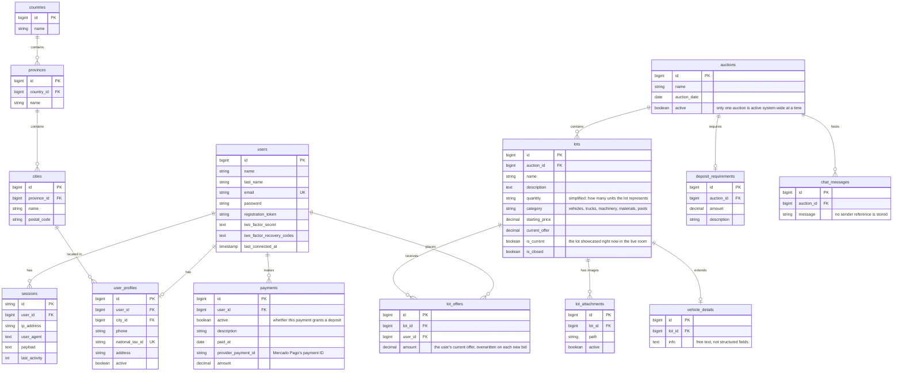

# Data model

[Back to README](../README.md)

The schema is based on the original project's migrations. Table and column names are translated to English here.

> **Note:** table names and their purpose come from the real migrations. Anything labeled **"simplified"** is lightly adapted for clarity (for example, merging a couple of narrow lookup tables) and may not match the original column names exactly.

## Entity-relationship diagram

## Tables

| Table (English name) | Original purpose | Notes |
|---|---|---|
| `users` | Accounts and credentials | Includes Jetstream's TOTP 2FA columns. The registration/reset token lives directly on this table, not a separate one |
| `user_profiles` | Personal data needed to bid | Carries a national tax ID, used in Argentina to verify a bidder's identity |
| `countries` / `provinces` / `cities` | Location catalog | Three-level hierarchy; cities also store a postal code |
| `auctions` | An auction event | The system only ever treats one auction as active at a time |
| `deposit_requirements` | The guarantee deposit amount for an auction | One row per auction, not per user — it just defines how much bidding in that auction costs |
| `lots` | An item (or batch) being auctioned | Categories: vehicles, trucks, machinery, materials, swimming pools. `is_current` flags the one lot shown in the live room right now |
| `lot_attachments` | Lot images | Each has an `active` flag, so an image can be disabled without deleting it |
| `vehicle_details` | Extra info for vehicle lots | A single free-text field, not structured make/model/year columns |
| `payments` | Payment records, mainly for guarantee deposits | Tied to a user, not to a specific auction or deposit requirement — the system relied on there being only one active auction when a payment was made |
| `lot_offers` | A user's current offer on a lot | One row per user per lot (unique pair); a new bid **overwrites** the amount rather than adding a history row |
| `chat_messages` | Live room chat history, scoped to an auction | Stores the message text only — no sender is recorded, so the saved history can't say who wrote what |
| `sessions` | Laravel database sessions | Standard Laravel table |

## Design notes

- **One active auction at a time.** Almost every query in the system starts from "the auction currently marked active." That kept the model simple, but it means the schema doesn't really support running two auctions in parallel without changes.
- **The deposit amount and the deposit payment are two different tables.** `deposit_requirements` says what an auction costs to bid in; `payments` says who actually paid and whether that payment is currently active. There's no foreign key tying a specific payment to a specific deposit requirement — it's inferred from which auction was active at the time.
- **Bidding keeps only the latest offer, not a ledger.** `lot_offers` has a unique constraint per lot and user, so placing a new bid updates the existing row. There's no append-only history of every bid a user made — only their current one.
- **Category-specific data in its own table.** Instead of adding nullable vehicle columns to every lot, vehicle data lives in `vehicle_details` (one-to-one with `lots`) as a single free-text field. Other categories don't pay for columns they never use.
- **Normalized location catalog.** Countries, provinces and cities live in separate tables, so profile addresses use consistent, selectable values instead of free text.
