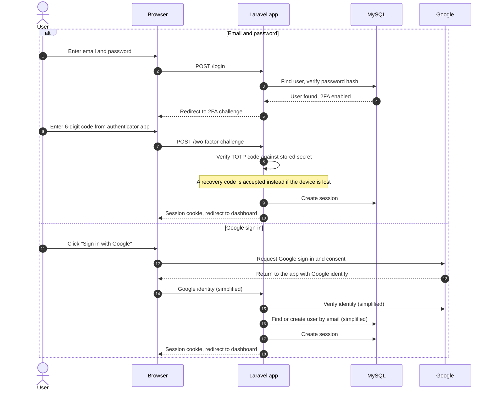
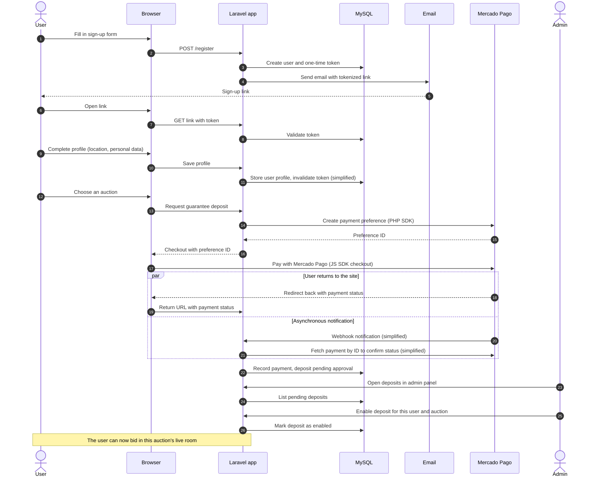
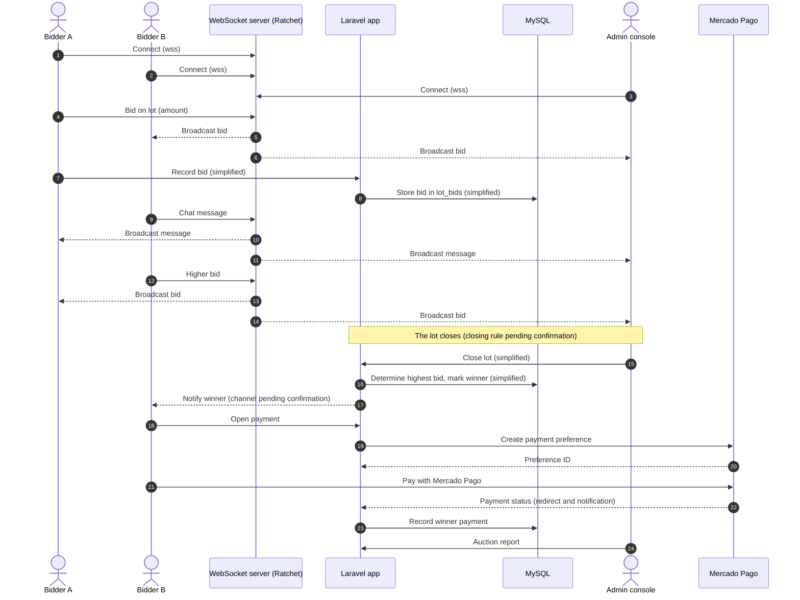

# Key flows

[Back to README](../README.md)

Sequence diagrams for the platform's most important flows. Steps marked **(simplified)** are inferred to explain the flow and may differ from the original implementation in details.

- [1. Sign-in: email and password with 2FA, and Google](#1-sign-in-email-and-password-with-2fa-and-google)
- [2. Registration and guarantee deposit](#2-registration-and-guarantee-deposit)
- [3. Live bidding, closing and winner payment](#3-live-bidding-closing-and-winner-payment)

---

## 1. Sign-in: email and password with 2FA, and Google

Users can sign in with email and password, protected by **TOTP two-factor authentication** (Laravel Jetstream), or with their **Google account**.

<!-- TODO: Describe the Google sign-in implementation (Socialite isn't a dependency), so the Google branch can be made precise. -->

**Why both?** Google sign-in removes friction for most users. Email and password with TOTP 2FA gives users without a Google account (or who prefer not to link one) an equally strong option, which matters on a platform that handles money.

---

## 2. Registration and guarantee deposit

Before bidding, a user has to (1) finish sign-up through an email link, (2) pay a guarantee deposit for a specific auction, and (3) get that deposit enabled by an admin.

**Why manual approval?** Payment confirmation proves the money arrived. Admin approval lets the auctioneer also check who the bidder is before they can bid, so a human stays in control of who joins a live auction.

**Why handle both the redirect and the notification?** The redirect gives users instant feedback, but it fails if they close the tab before returning. The server-to-server notification makes sure the payment is recorded anyway.

---

## 3. Live bidding, closing and winner payment

The live room runs over WebSockets. The Ratchet server forwards each message (bid or chat) to every other connected client, including the admin's live console.

<!-- TODO: How did a lot close: a timer, or the admin from the live console? -->
<!-- TODO: Was the winner notified by email, on screen, or both? -->
<!-- TODO: Did the winner pay the full amount or the balance after the guarantee deposit? -->
<!-- TODO: Where were bids persisted: did the client post them to Laravel, or did the admin console record the result? -->

**Why a pure relay?** A WebSocket server that only forwards messages is small, fast and easy to reason about, which is a good fit for one room with up to 50 people. The downside is that it doesn't check what it forwards. Today I'd validate and persist each bid on the server *before* broadcasting it, so the server is the single source of truth for the current highest bid.
