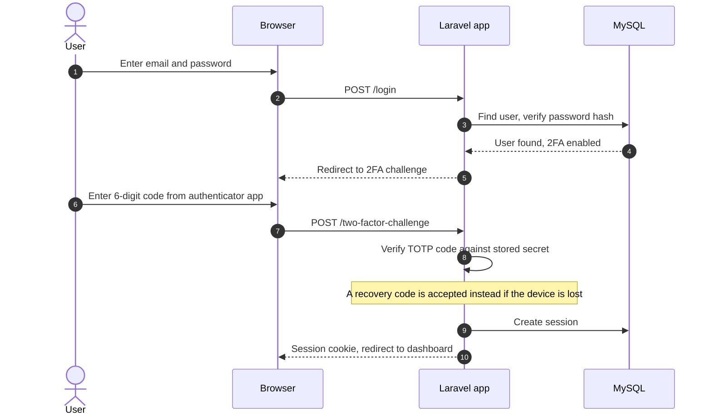
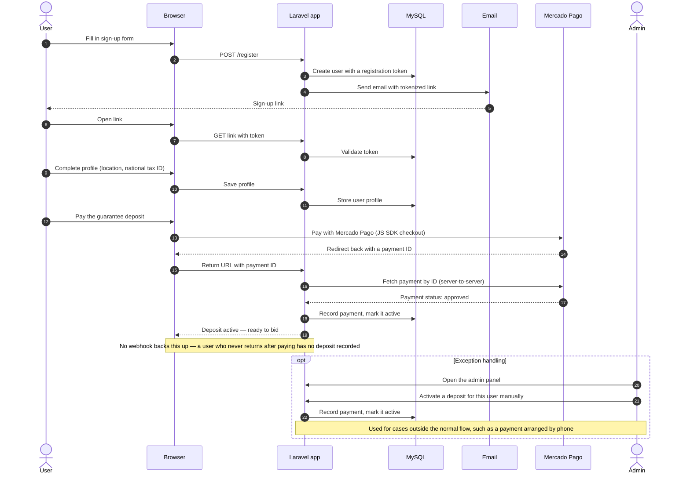
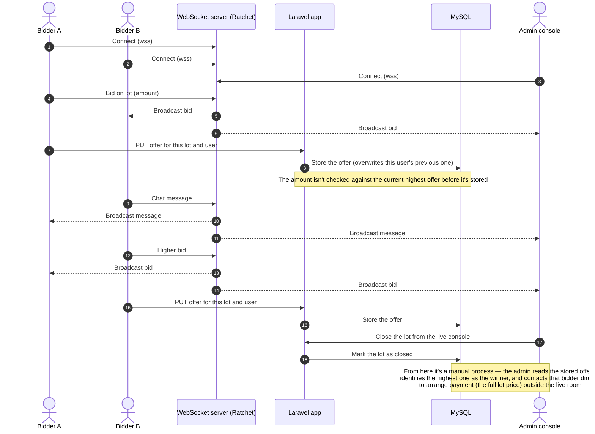

# Key flows

[Back to README](../README.md)

Sequence diagrams for the platform's most important flows.

- [1. Sign-in with 2FA](#1-sign-in-with-2fa)
- [2. Registration and guarantee deposit](#2-registration-and-guarantee-deposit)
- [3. Live bidding, closing and winner payment](#3-live-bidding-closing-and-winner-payment)

---

## 1. Sign-in with 2FA

Users sign in with email and password, protected by **TOTP two-factor authentication** (Laravel Jetstream).

**Why TOTP?** The platform handles deposits and payments, so I added a second factor beyond the password. Jetstream's built-in support meant this didn't need a custom implementation.

---

## 2. Registration and guarantee deposit

Before bidding, a user finishes sign-up through an email link, then pays the guarantee deposit required for the active auction.

**Why re-fetch the payment instead of trusting the redirect?** A redirect's query string can be tampered with or arrive incomplete. Asking Mercado Pago directly for that payment's status means what gets saved reflects what the provider actually recorded.

**Why no webhook?** That's a gap, not a design choice — see "What I'd do differently today" in the [README](../README.md).

---

## 3. Live bidding, closing and winner payment

The live room runs over WebSockets. The Ratchet server forwards each message (bid or chat) to every other connected client, including the admin's live console. Bids are also posted to a small Laravel endpoint so they're persisted, not just broadcast.

**Why a pure relay?** A WebSocket server that only forwards messages is small, fast and easy to reason about, which is a good fit for one room with up to 50 people. The downside is that it doesn't check what it forwards, and the endpoint behind it doesn't either — it accepts whatever offer a client sends. Today I'd validate each bid on the server before accepting and broadcasting it, so the server is the single source of truth for the current highest offer.

**Why no automated winner flow?** The application doesn't determine or notify a winner on its own; closing a lot just marks it closed. Identifying the winner and collecting payment happened as a manual step outside the system.
